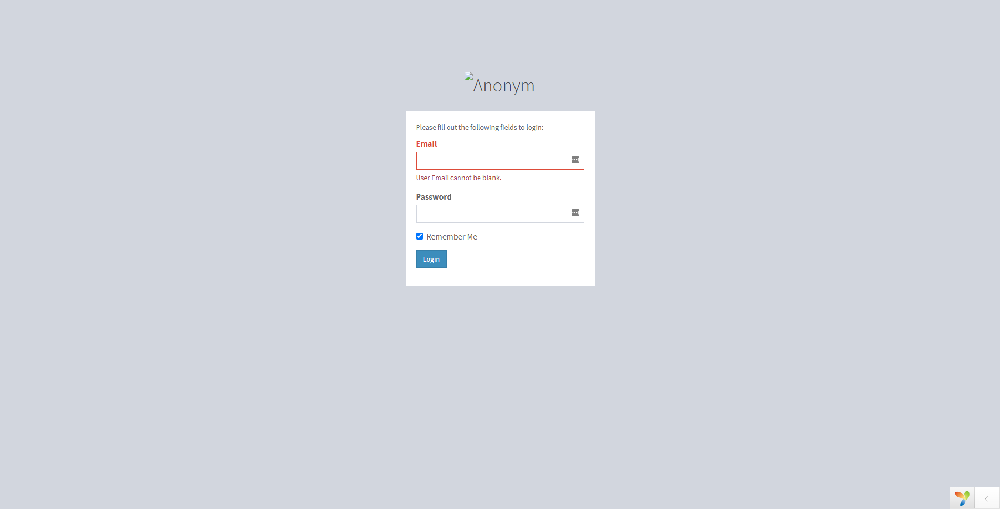
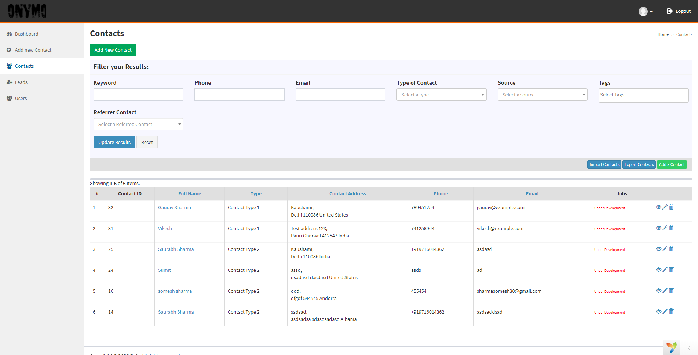
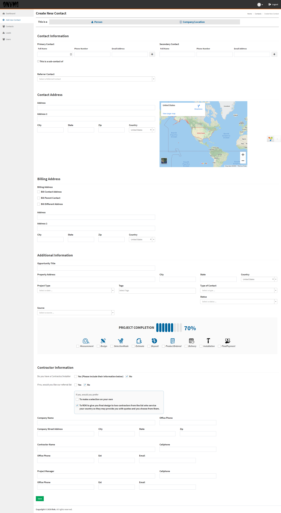
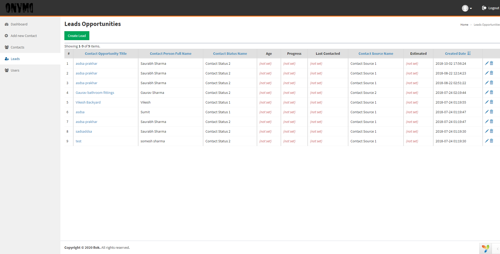
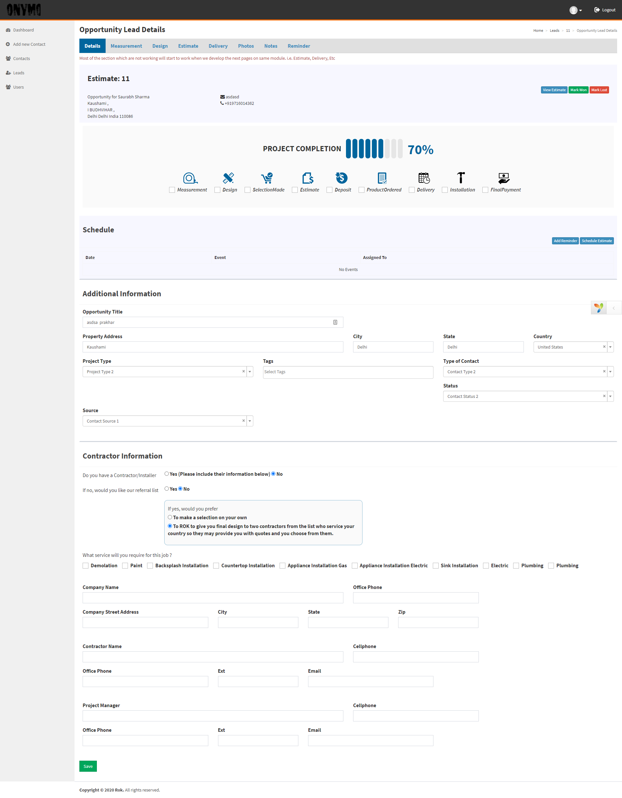
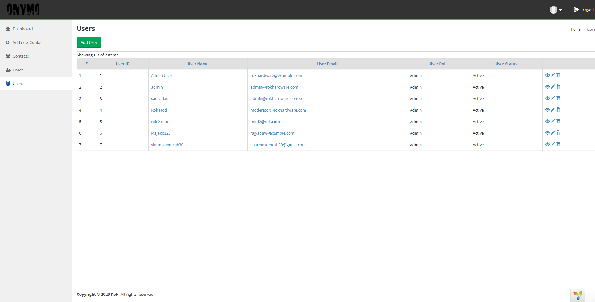
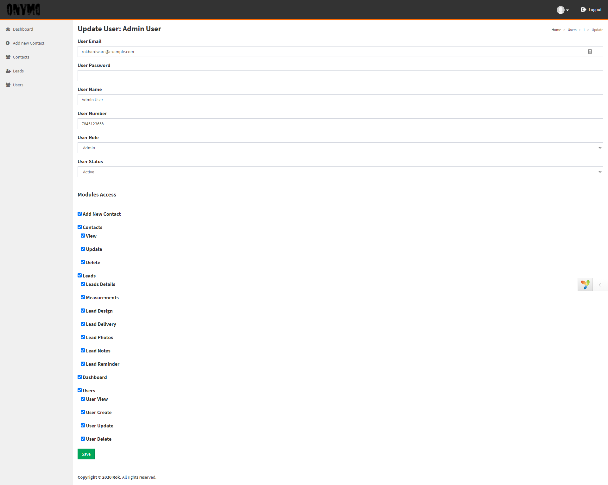

# Worksample-2

A CRM worksample, this CRM is used by a Hardware E-commerce platform which provides wholesale cabinet hinges, drawer slides, organizers, knobs, pulls, plus other home, kitchen, and builder's hardware. 
this CRM is used to create Customers, Leads, Orders (on customer behalf), Invoices, to see Feedback list etc. 

**Note: Only necessary files/modules/screenshots are provided for code reviews. Project name, email, API docs, URLs are anonymized for security purposes.** 

| Attribute | Value |
| ------ | ------ |
| Framework | [Yii2](https://www.yiiframework.com/doc/guide/2.0/en/intro-yii) |
| PHP | 7.* |
| Database | MySQL 5.* |
| Web Server | Apache |
| Years Active | 2018 |
| Team Members | 3 (1 Backend, 1 QA, 1 PM) |

DIRECTORY STRUCTURE
-------------------
      assets/             contains AdminLTE css and js assets definition
      config/             contains application configurations
      controllers/        contains Web controller classes
      mail/               contains view files for e-mails
      models/             contains model classes
      screenshots/        contains screenshots of the working application
      views/              contains view files for the Web application
      web/                contains the entry script and Web resources

SCREENSHOT
-------------------
### Login

### Contact

### Leads

### Users

